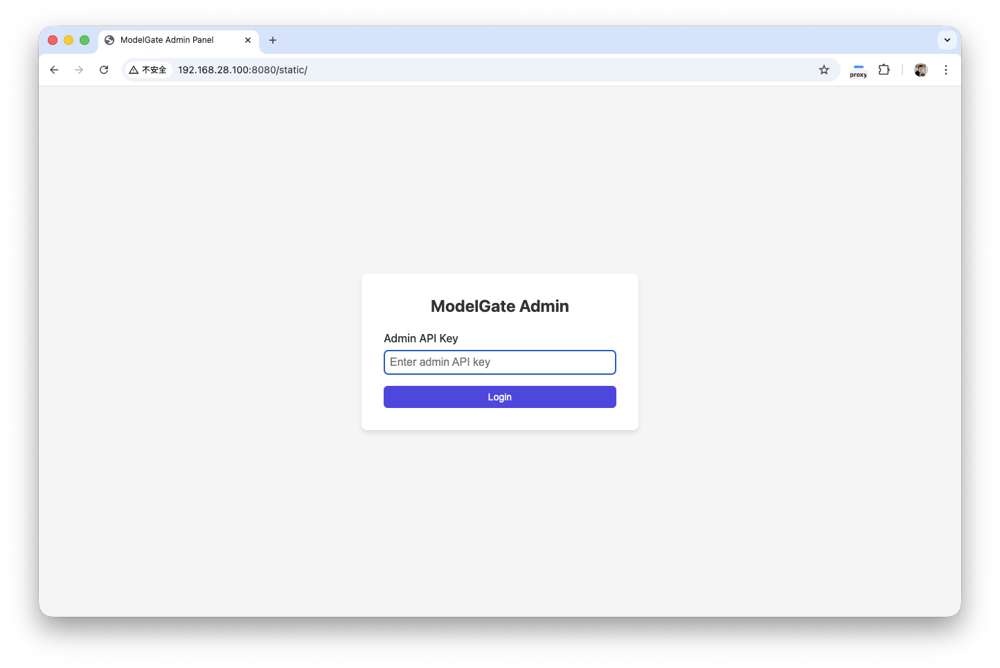
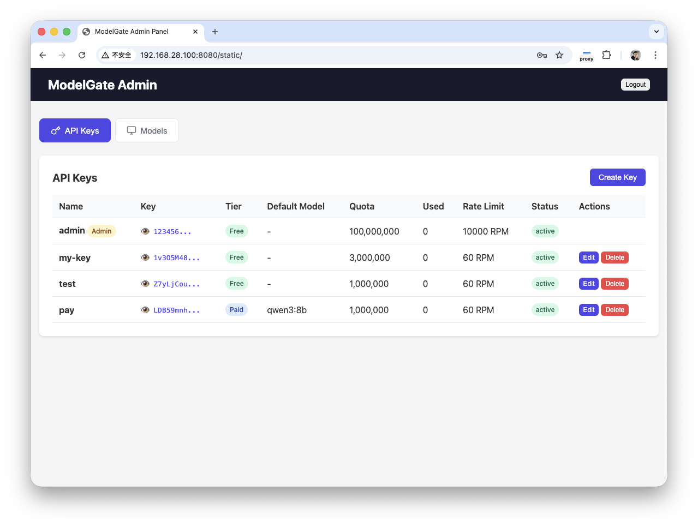
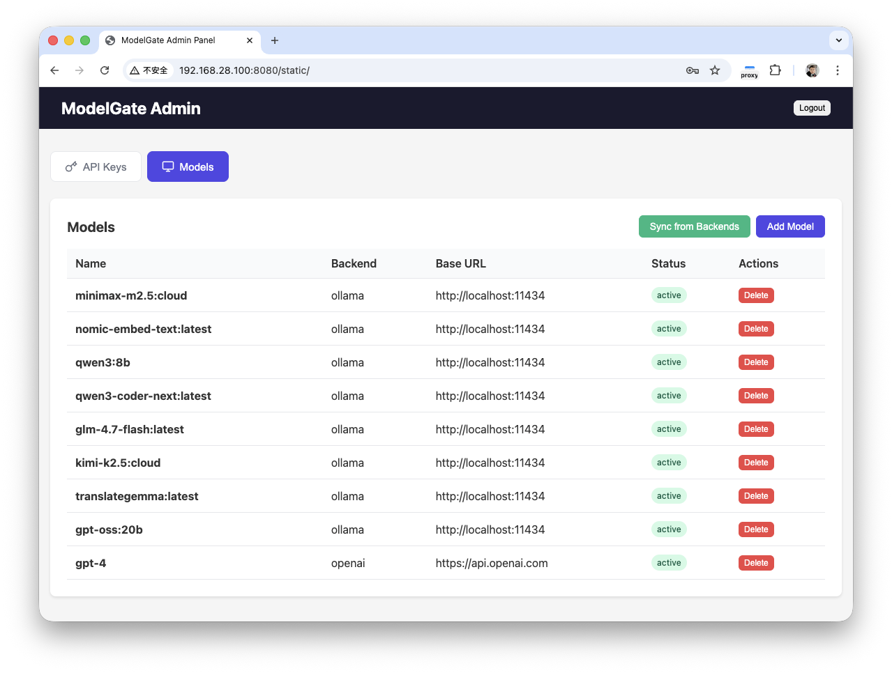
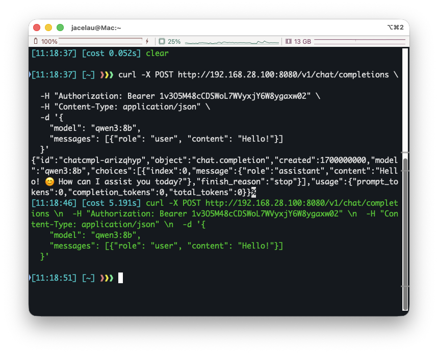

# ModelGate

A production-grade Go-based LLM API Gateway providing OpenAI-compatible endpoints with support for Ollama, vLLM, llama.cpp, OpenAI, and API3 backends.

## Features

- **Multi-Backend Support**: Ollama, vLLM, llama.cpp, OpenAI, API3
- **API Key Authentication**: SHA256 hashed API keys
- **Rate Limiting**: Redis-based RPM limiting
- **Quota Enforcement**: Token quota per API key
- **Admin Panel**: Web UI & CLI for key and model management
- **OpenAI Compatible**: Works with OpenAI SDK

## Quick Start

### Using Docker Compose

```bash
docker-compose up -d
```

### Manual Setup

1. Build the binary:
```bash
make build
```

2. Run the server:
```bash
./modelgate
```

The server will start on `http://localhost:8080`

**Note**: On first start, check logs for the admin API key or set it in `configs/config.yaml`

## Configuration

Edit `configs/config.yaml`:

| Setting | Default | Description |
|---------|---------|-------------|
| server.port | 8080 | HTTP port |
| database.path | ./data/modelgate.db | SQLite database path |
| redis.addr | localhost:6379 | Redis address |
| rate_limit.rpm | 60 | Requests per minute |
| quota.default_tokens | 1000000 | Default token quota |
| timeout | 300s | Request timeout |
| max_body_size | 5242880 | 5MB body limit |
| admin.api_key | "" | Admin API key (required on first startup) |

### Admin API Key Configuration

```yaml
# configs/config.yaml
admin:
  api_key: "your_secure_admin_key"  # Required on first startup
```

**Behavior:**
- **First start (empty DB)**: Requires configured key (or `MG_ADMIN_API_KEY`)
- **Config change**: Updates database on server restart
- **Environment override**: `MG_ADMIN_API_KEY=your_key ./modelgate`

## API Endpoints

### Public

- `GET /health` - Health check
- `GET /v1/models` - List available models

### Protected (requires Bearer token)

- `POST /v1/chat/completions` - Chat completion
- `POST /v1/completions` - Text completion

### Admin

- `GET /admin/keys` - List API keys
- `POST /admin/keys` - Create API key
- `PUT /admin/keys/:id` - Update API key
- `DELETE /admin/keys/:id` - Delete API key
- `GET /admin/models` - List models
- `POST /admin/models` - Create model
- `PUT /admin/models/:id` - Update model
- `DELETE /admin/models/:id` - Delete model
- `POST /admin/models/sync` - Sync models from backends
- `GET /admin/verify` - Verify admin key

## Admin Management

Two ways to manage API keys and models:

### 1. Web Admin UI

Access at `http://ip:8080/`



Login with admin API key:



Manage models:



### 2. CLI Admin Tool

```bash
make build-cli
```

#### Global Options

| Option | Alias | Default |
|--------|-------|---------|
| --server | -s | http://ip:8080 |
| --api-key | -k | (required) |
| --config | -c | ./configs/config.yaml |

```bash
# Via env vars
export MODELGATE_SERVER=http://localhost:8080
export MODELGATE_API_KEY=your_admin_key

# Via flags
./modelgate-cli -s http://localhost:8080 -k your_admin_key <command>
```

#### Commands

```bash
# API Keys
./modelgate-cli key list
./modelgate-cli key create -n "my-key" -q 1000000 -r 60
./modelgate-cli key update --quota 2000000 -k your_admin_key 3    # flags before ID
./modelgate-cli key delete 3

# Models
./modelgate-cli model list
./modelgate-cli model create -n llama2 -b ollama -u http://localhost:11434
./modelgate-cli model update 1 --enabled true
./modelgate-cli model delete 1

# Sync models from backends
./modelgate-cli sync -k your_admin_key                 # sync all backends
./modelgate-cli sync -k your_admin_key --dry-run      # preview only
```

#### Flags

| Flag | Alias | Description |
|------|-------|-------------|
| -n | --name | Name |
| -q | --quota | Token quota |
| -r | --rate-limit | Requests/minute |
| -i | --allowed-ips | Allowed IPs |
| -b | --backend | ollama/vllm/llamacpp/openai/api3 |
| -u | --base-url | Backend URL |
| -e | --enabled | Enable/disable |

## Example Usage

### cURL

```bash
# Get user API key from admin panel or CLI
# Chat completion
curl -X POST http://192.168.28.100:8080/v1/chat/completions \
  -H "Authorization: Bearer your-user-api-key" \
  -H "Content-Type: application/json" \
  -d '{
    "model": "qwen3:8b",
    "messages": [{"role": "user", "content": "Hello!"}]
  }'

# List models
curl http://localhost:8080/v1/models \
  -H "Authorization: Bearer your-user-api-key"
```



### Python OpenAI SDK

```python
from openai import OpenAI

client = OpenAI(
    api_key="YOUR_API_KEY",
    base_url="http://localhost:8080/v1"
)

response = client.chat.completions.create(
    model="llama2",
    messages=[{"role": "user", "content": "Hello!"}]
)
print(response.choices[0].message.content)
```

## Makefile Commands

```bash
make build        # Build binary
make build-cli    # Build CLI tool
make all          # Build all
make run          # Build and run
make test         # Run tests
make docker-up    # Start Docker services
make docker-down  # Stop Docker services
make clean        # Clean build artifacts
```

## Project Structure

```
modelgate/
├── cmd/
│   ├── server/main.go       # Server entry point
│   └── cli/main.go          # CLI admin tool
├── internal/
│   ├── adapters/            # Backend adapters
│   ├── admin/               # Admin API
│   ├── auth/                # API key auth
│   ├── config/              # Configuration
│   ├── database/            # SQLite setup
│   ├── limiter/             # Rate limiter
│   ├── middleware/          # HTTP middleware
│   ├── models/              # DB models
│   ├── service/             # Business logic
│   ├── usage/               # Usage tracking
│   └── utils/               # Helpers
├── configs/config.yaml       # Config file
├── admin/index.html          # Admin panel
├── docs/imgs/                # Documentation images
├── Dockerfile
├── docker-compose.yml
└── Makefile
```

## Environment Variables

All config options can be set via environment variables with `MG_` prefix:

```bash
MG_SERVER_PORT=8080 \
MG_DATABASE_PATH=./data/modelgate.db \
MG_REDIS_ADDR=localhost:6379 \
./modelgate
```
